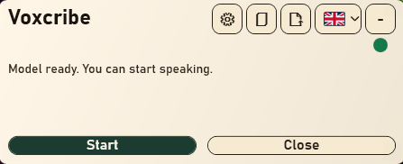
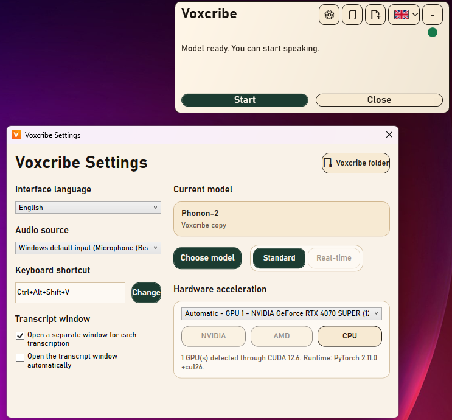

# Voxcribe for Windows

[](https://github.com/jieme54/Voxcribe-for-win/actions/workflows/release.yml)
[](LICENSE)

Voxcribe is a compact Windows overlay for local speech transcription. Transcribe
your microphone, other Windows audio sources, or existing audio and video files.
The application supports English and French interfaces.

## Download

**[Download Voxcribe for Windows x64 (ZIP)](https://github.com/jieme54/Voxcribe-for-win/releases/latest/download/Voxcribe-Windows-x64.zip)**

[All releases and release notes](https://github.com/jieme54/Voxcribe-for-win/releases)
 · [SHA-256 checksum](https://github.com/jieme54/Voxcribe-for-win/releases/latest/download/SHA256SUMS.txt)

1. Download the ZIP and extract it completely.
2. Open the `Voxcribe` folder and run `Voxcribe.exe`.
3. In settings, install the runtime for your PC: NVIDIA, supported AMD, or CPU.
   The CPU option also works without a compatible graphics card.
4. Download a model from settings, choose your audio source, and start transcribing.

The package includes .NET. You do not need the .NET SDK or a separate .NET
runtime installation. Internet access is required to install the Python runtime
and download models; transcription then runs locally on your computer.
Runtimes and models are downloaded separately and may require several gigabytes.

**Requirements:** Windows 11 x64. RAM, VRAM, and storage requirements depend on
the selected model. Available models and transcription modes are filtered in
the application; some models require more powerful hardware.

Settings, runtimes, and downloaded models are stored under
`%LocalAppData%\Voxcribe`, outside the portable application folder.

## Screenshots

### Compact overlay

The overlay provides recording controls, model status, and quick access to
settings, transcripts, file import, and the interface language.



### Settings

Choose your audio source, keyboard shortcut, model, transcription mode, and
hardware acceleration. Transcript window preferences are available here too.



## Features

- Compact, always-on-top overlay with Windows notification area support.
- Microphone and other Windows audio sources.
- Standard and real-time transcription, depending on the selected model.
- Audio and video file import, including drag and drop.
- Transcript window with selectable text and a copy button.
- Text insertion into the active application when supported by the selected mode.
- Global keyboard shortcut and English / French interface options.
- Runtime installation and model downloads from the settings window.

## Open source

**[Download the source code (ZIP)](https://github.com/jieme54/Voxcribe-for-win/archive/refs/heads/main.zip)**

```powershell
git clone https://github.com/jieme54/Voxcribe-for-win.git
cd Voxcribe-for-win
```

Voxcribe's source code is released under the [MIT License](LICENSE).
Dependencies and model weights retain their own licenses; see the
[third-party notices](THIRD_PARTY_NOTICES.md). In particular, CrisperWhisper 2.0
weights are restricted to research and non-commercial use unless you obtain
a separate license from Nyra.

## Build from source

On Windows, with the **.NET 8 SDK** installed:

```powershell
dotnet build .\src\TranscriptionOverlay\TranscriptionOverlay.csproj -c Release
powershell -ExecutionPolicy Bypass -File .\scripts\package-release.ps1
```

The packaging script creates `Voxcribe-Windows-x64.zip` and `SHA256SUMS.txt`
under `dist\release-<version>\`. Python is not required to build this lightweight
package. To run or configure the Python backend during development, see the
[development guide](docs/DEVELOPMENT.md).

The Windows interface source is in [src/TranscriptionOverlay](src/TranscriptionOverlay),
the Python backend is in [backend](backend), and the build scripts are in
[scripts](scripts).

GitHub Actions builds the project on each push to `main` and publishes a release
when the project defines a new version. Published application assets are kept:
increment `<Version>` and update `docs/RELEASE_NOTES.md` for the next release.
The workflow can also be run manually.
